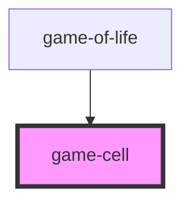

# game-cell

<!-- Auto Generated Below -->

## Properties

| Property | Attribute | Description | Type      | Default     |
| -------- | --------- | ----------- | --------- | ----------- |
| `alive`  | `alive`   |             | `boolean` | `false`     |
| `cellId` | `cell-id` |             | `number`  | `undefined` |

## Dependencies

### Used by

 - [game-of-life](../game-of-life)

### Graph

----------------------------------------------

*Built with [StencilJS](https://stenciljs.com/)*
